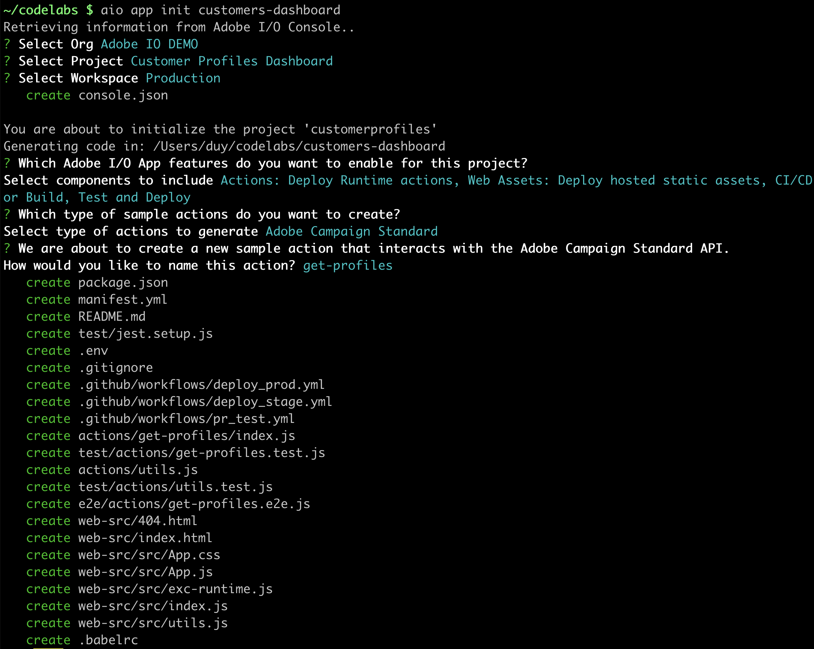
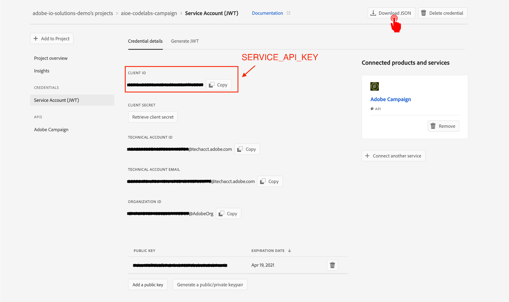

## Lesson 1: Create a new Firefly app from ACS template

To initialize a Firefly app, let's use init command from the CLI.

```bash
aio app init customers-dashboard
```

You're presented with a few options what you want your app to include (serverless actions, web UI assets, CI/CD pipeline). In this lab, we keep all of them.

The second question asks you to select the sample actions to be created as part of the initial app. As customer profiles are pulled from ACS, we are going to select `Adobe Campaign Standard` for this question (by pressing `<Space>` to select / de-select, and `<Enter>` to confirm the choice).

Then you will be asked to specify the names of the sample action. Let's name it `get-profiles`.



What happens next, is that from the command line a developer project is created including the Adobe I/O Runtime actions, configuration files, tests etc. You could explore your project in VS Code, either by opening VSCode -> Open... -> select app folder, or typing the following command.

```bash
code customers-dashboard
```


To complete the app configuration, please set your I/O Runtime credentials in the `.env` file, namely `AIO_RUNTIME_NAMESPACE` and `AIO_RUNTIME_AUTH`. For ACS integration, you also need to set the two required variables for `CAMPAIGN_STANDARD_API_KEY` and `CAMPAIGN_STANDARD_TENANT`.  
`CAMPAIGN_STANDARD_API_KEY` can be retrieved from I/O Console portal.



`CAMPAIGN_STANDARD_TENANT` is the subdomain of your ACS instance.


All set environment variables should be then uncommented.


[Next](lesson2.md)
