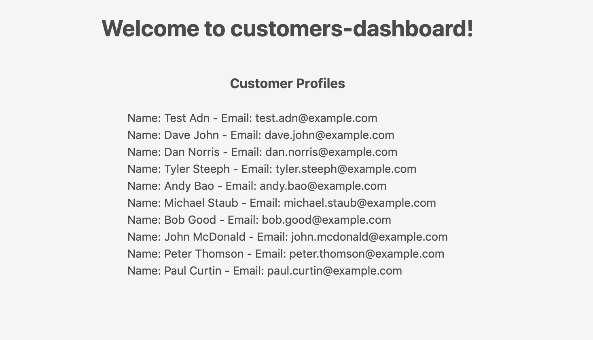

## Lesson 4: List All Customer Profiles on the UI

We're going to use [React Spectrum](https://react-spectrum.adobe.com/react-spectrum/index.html) to enhance the UI of this app. To learn more about React Spectrum, you're recommended to go through the [Spectrum Introduction Codelab](https://adobeio-codelabs-spectrum-intro-adobedocs.project-helix.page).  

Open `App.js`. In the default example, customer profiles are only loaded to the frontend once you click the "Invoke" button. Now we want the profiles automatically loaded when the page is ready, without any human interaction. We will need a new `profiles` param in the component's state, and the `componentWillMount` method to initiate loading profiles.  

Within `constructor (props)`:

```javascript
this.state = {
  actionSelected: null,
  actionResponse: null,
  actionResponseError: null,
  actionHeaders: null,
  actionHeadersValid: null,
  actionParams: null,
  actionParamsValid: null,
  actionInvokeInProgress: false,
  profiles: null
}
```

After that, add the following:

```javascript
async componentWillMount () {
  this.setState({ actionInvokeInProgress: true })
  
  const headers = {}
  const params = {}

  // set the authorization header and org from the ims props object
  if (this.props.ims.token && !headers.authorization) {
    headers.authorization = 'Bearer ' + this.props.ims.token
  }
  if (this.props.ims.org && !headers['x-gw-ims-org-id']) {
    headers['x-gw-ims-org-id'] = this.props.ims.org
  }
  try {
    const actionResponse = await actionWebInvoke('get-profiles', headers, params)
    this.setState({ profiles: actionResponse.body.content, actionResponseError: null, actionInvokeInProgress: false })
    console.log(`action response:`, actionResponse)
  } catch (e) {
    console.error(e)
    this.setState({ profiles: null, actionResponseError: e.message, actionInvokeInProgress: false })
  }
}
```

Finally, delete the `invokeAction ()` and `setJSONInput ()` methods as we don't need them anymore.

Next, we will replace the action invoke form and list of docs in the default template, by a list of customer profiles returned by the `get-profiles` action. It should display first name, last name, and email of the customers.  

*Note: For simplicity of the lab, we only display the first page of the result. In a real environment, where there are hundreds of profiles, results are returned in batches, so you will need to handle pagination of data accordingly.*

We will use `<Flex>` and `<Grid>` to layout spectrum components on the page. Both are supported in React Spectrum.

```javascript
import { Flex, Grid } from '@react-spectrum/layout'
```

The `render()` method should look like following. You can also apply some CSS styling in the `App.css` file to make it look nice.

```javascript
render () {
  const profiles = this.state.profiles
  console.log(`profiles object:`, profiles)
  return (
    // ErrorBoundary wraps child components to handle eventual rendering errors
    <ErrorBoundary onError={ this.onError } FallbackComponent={ this.fallbackComponent } >
    <Provider UNSAFE_className='provider' theme={ theme }>
      <Flex UNSAFE_className='main'>
        <Heading UNSAFE_className='main-title'>Welcome to customers-dashboard!</Heading>

        <Flex UNSAFE_className='profiles'>
          <h3 className='main-title'>Customer Profiles</h3>
          <ProgressCircle
                UNSAFE_className='actions-invoke-progress'
                aria-label='loading'
                isIndeterminate
                isHidden={ !this.state.actionInvokeInProgress }/>
          { !!profiles &&
            <Grid>
              {profiles.map((profile, i) => {
                return <Flex UNSAFE_className='profile'>Name: { profile['firstName'] } { profile['lastName'] } - Email: { profile['email'] } - Date of birth: { profile['birthDate'] }</Flex>
              })}

            </Grid>
          }
          { !profiles &&
            <Text>No profiles!</Text>
          }

        </Flex>
      </Flex>
    </Provider>
    </ErrorBoundary>
  )
}
```

As your app is already running once you ran `aio app run` in the previous lesson, just refresh the webpage at https://experience.adobe.com/?devMode=true#/apps/?localDevUrl=https://localhost:9080 to see the updated UI.



[Next](lesson5.md)