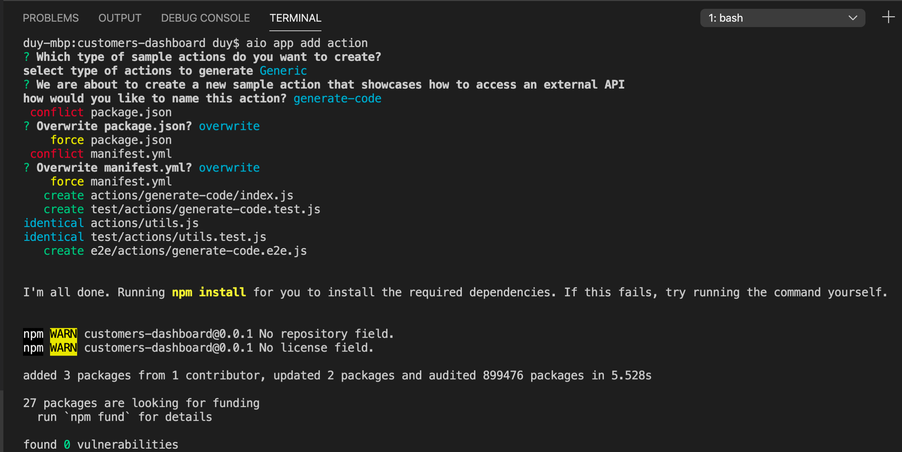
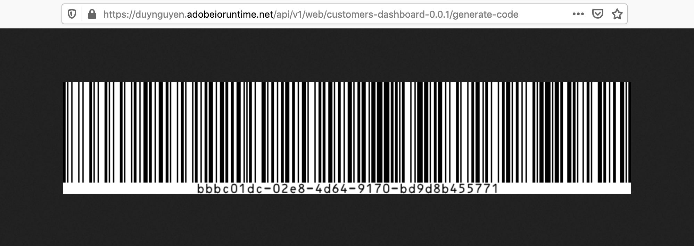
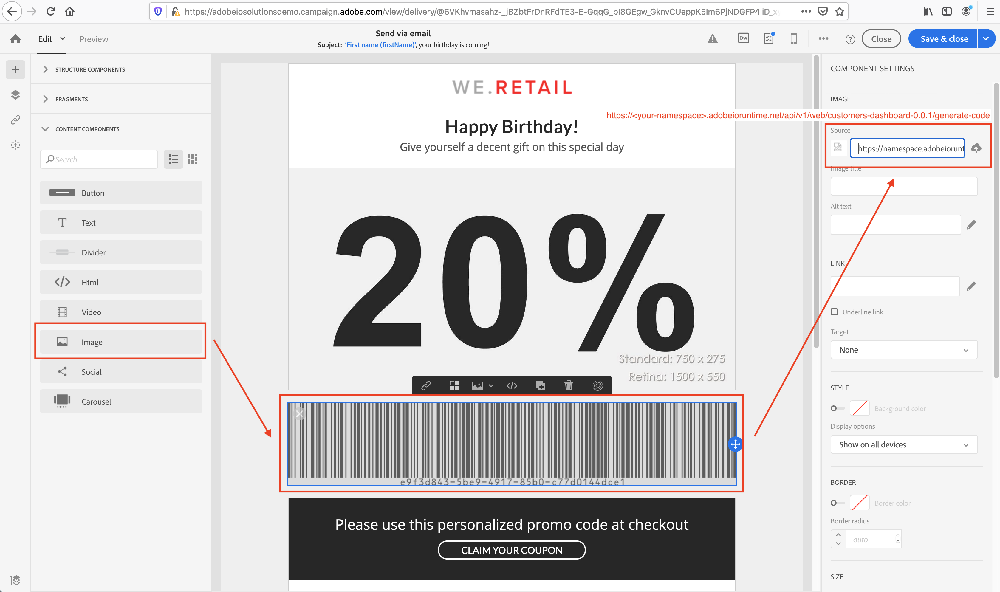
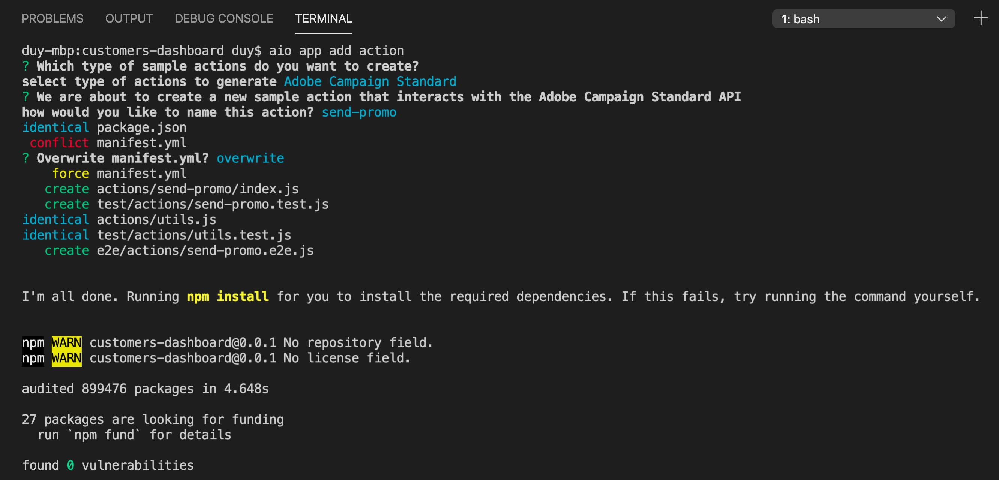
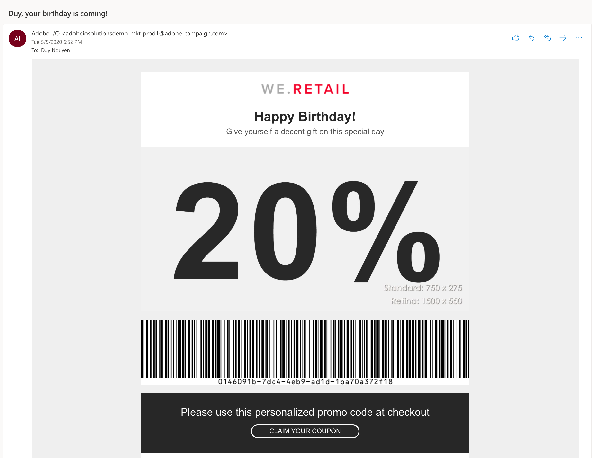

## Lesson 5: Add Personalized Promotion Emails Triggering

*Note: This is an advanced lesson of the codelab. You are recommended to go through it, but feel free to skip and jump to the [Recap](recap.md).*

Now that your app displays a list of customer profiles, let's try adding some user interaction to it. Imagine as a marketer looking at different customer profiles with more extensive data (past orders, date of birth, gender), you may want to send promotional discount code to some specific customers to motivate them to buy your products. Therefore, we will add a "Send promo code" button.

First of all, you need a new action for generating promo code. Here we use the [uuid](https://www.npmjs.com/package/uuid) npm package to generate it, and [bwip-js](https://www.npmjs.com/package/bwip-js) to render a visual barcode. Simply add them as a dependency in package.json, and run `npm install`. To add the new action, run the following `aio` command, and specify the inputs according to the screenshot below.

```bash
aio app add action
```


Upon a successful command execution, the `generate-code` action is added to the manifest.yml file, and its source code is at `actions/generate-code/index.js`. As we don't need an authentication on this action, we will remove `require-adobe-auth: true` from its definition in manifest file, as well as remove the relevant authorization checks in the code. In addition, we add the code for generating UUID and return it in the response body.

```javascript
/**
 * This action generates a barcode of a random UUID as personalized promo code
 */

const { Core } = require('@adobe/aio-sdk')
const { v4: uuid4 } = require('uuid')
const bwipjs = require('bwip-js')
const { errorResponse } = require('../utils')

// main function that will be executed by Adobe I/O Runtime
async function main (params) {
  // create a Logger
  const logger = Core.Logger('main', { level: params.LOG_LEVEL || 'info' })

  try {
    // 'info' is the default level if not set
    logger.info('Calling the main action')

    // generate UUID code
    const promoCode = uuid4()
    const buffer = await bwipjs.toBuffer({
      bcid: 'code128',
      text: promoCode,
      scale: 2,
      includetext: true,
      backgroundcolor: 'ffffff'
    })
    const response = {
      headers: { 'Content-Type': 'image/png' },
      statusCode: 200,
      body: buffer.toString('base64')
    }

    // log the response status code
    logger.info(`${response.statusCode}: successful request`)
    return response
  } catch (error) {
    // log any server errors
    logger.error(error)
    // return with 500
    return errorResponse(500, 'server error', logger)
  }
}

exports.main = main
```

Verify that the new action is working by running the app locally with `aio app run`, and check the response of https://`<your-namespace>`.adobeioruntime.net/api/v1/web/customers-dashboard-0.0.1/generate-code on the browser. You can find your own URL from the terminal output.



Now that you have it set up in Firefly app, next step is to create a marketing workflow in ACS which takes care of receiving triggers from the app and sending promotion emails. To do that, go to *Marketing Activities > Create > Workflow*. Define the properties of your workflow, and finish the creation.

Send email:
Select type: Recurring email
Send via email
Use the Email Designer
We select "Astro - Coupon" template

Design the email as you prefer. One required component is an image that loads the barcode from the `generate-code` action.



Save your ACS Workflow. It should be now ready to execute!  

The last step is to add an action to trigger the ACS workflow, and a "Send promo code" button on the app UI. We use `aio app add action` again to add the `send-promo` action.



Open `App.js` and add the following component `<Button>` and method `sendPromo()`.

```javascript
<Button>
```

```javascript
sendPromo()
```

After that, do `aio app run` again so that your app is running locally.


There will be a prompt confirming your command. Check your email inbox that you have received a promo email.



Congrats! Now you have your first Firefly app integrated with Adobe Campaign Standard working.

Next: [Recap](recap.md)